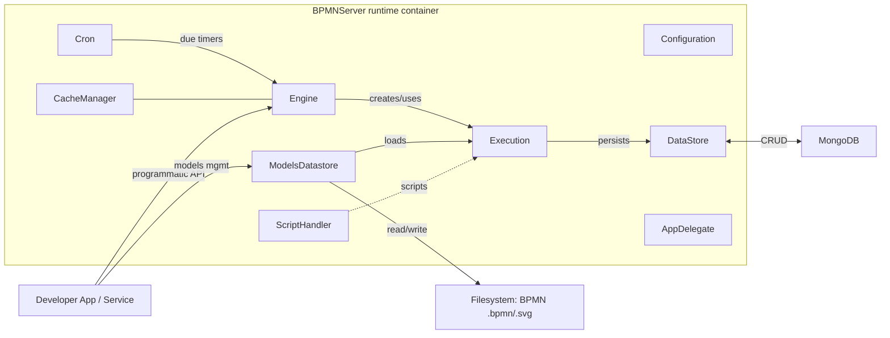

# Architecture Overview

## 1. Project Overview
- Purpose of the system
  - A TypeScript/Node.js BPMN 2.0 workflow engine and server library that parses, executes, and persists BPMN process models.
- Primary responsibilities
  - Load BPMN models from filesystem and/or datastore.
  - Execute processes (start, invoke user/service tasks, route through gateways, handle events).
  - Persist instances, items (node executions), and related metadata to a datastore (MongoDB by default).
  - Manage timers (cron/ISO-8601) and background wake-ups for due events.
  - Provide a programmatic API for starting and interacting with processes, and for querying execution data and models.
- Key constraints or assumptions
  - Default persistence targets MongoDB (configurable); models also stored as files by default and mirrored to DB.
  - Consumers embed and bootstrap `BPMNServer` in their application; HTTP endpoints are not defined in this repository (inference: the Postman collection reflects endpoints typically exposed by integrating apps).
  - Single-process eventing via Node `EventEmitter`; optional in-memory instance cache.

## 2. High-Level Architecture
- Major components or layers
  - Server Composition: `BPMNServer` wires all subsystems from `Configuration`.
  - Execution Engine: `Engine` façade orchestrates `Execution` lifecycles over BPMN models.
  - Execution Internals: `Execution`, `Token`, `Item`, `Model`, and element `Behaviours` implement BPMN semantics.
  - Persistence: `DataStore`, `MongoDB`, `ModelsDatastore*`, `InstanceLocker`, query helpers.
  - Scheduling: `Cron` (timers, repeat timers) and `ScriptScheduler`.
  - API Layer: `BPMNAPI` with `APIEngine`, `APIData`, `APIModel` for programmatic access.
  - Common/Config: `Configuration`, `Logger`, `ScriptHandler`, `DefaultAppDelegate`.
- Control and data flow at runtime
  - App constructs `new BPMNServer(configuration, logger?, options)`.
  - `BPMNServer` instantiates `Engine`, `Cron`, `DataStore`, `ModelsDatastore`, `CacheManager`, `ScriptHandler`, `AppDelegate`.
  - Calls to `server.engine.*` (e.g., `start`, `invoke`) create/restore an `Execution` which loads a `Model`, advances tokens through nodes, and persists state via `DataStore`.
  - `Cron` periodically queries datastore for due timers and signals the engine to resume affected instances.
  - API wrappers (`APIEngine`, `APIData`, `APIModel`) mediate access and user context; they delegate to `Engine` or datastore services.

## 3. Component Responsibilities
- BPMNServer (src/server/BPMNServer.ts)
  - Composition root and runtime container. Owns instances of Engine, Cron, Cache, DataStore, ModelsDatastore, AppDelegate, ScriptHandler; exposes status; sets a singleton for global access and error reporting.
- Engine (src/server/Engine.ts)
  - Public façade for process lifecycle operations: `start`, `invoke`, `assign`, `restart`, `startEvent`, `throwMessage`, `throwSignal`, `upgrade`. Manages instance locking, restore/resume, and coordinates with `Execution`.
- Execution (src/engine/Execution.ts)
  - Drives the execution of a single process instance. Manages tokens and items, queues work, processes events, saves state, and emits model/application events.
- Token / Item / Model (src/engine/*.ts)
  - `Token`: Flow of control through sequence flows; `Item`: runtime node/flow execution record; `Model`: in-memory representation of parsed BPMN used during execution.
- Elements & Behaviours (src/elements/*, src/elements/behaviours/*)
  - Typed nodes (Tasks, Events, Gateways, etc.) and behaviors (Script, IO, Loop, Timer, Message/Signal, Error, Escalation, Terminate). Responsible for node-specific runtime semantics.
- DataStore & MongoDB (src/datastore/*)
  - `DataStore`: High-level persistence API for instances and items; implements queries, archiving, installation. Uses `MongoDB` wrapper for CRUD and `QueryTranslator`/`Aggregate` for queries/aggregation. `InstanceLocker` provides concurrency control.
- ModelsDatastore (src/datastore/ModelsDatastore*.ts)
  - Manages BPMN model sources and SVGs. Loads from filesystem path (`definitionsPath`) and syncs metadata to DB; supports listing, save, rename, delete, rebuild from files.
- Cron & ScriptScheduler (src/server/Cron.ts)
  - Background scheduler for due timers and repeat events. Computes next due time from cron or ISO durations, and triggers engine to continue affected instances. `ScriptScheduler` can schedule script execution tied to items.
- CacheManager (src/server/CacheManager.ts)
  - Optional in-memory tracking of live executions; cleans up on process end; supports shutdown handling.
- API Layer (src/API/API.ts)
  - `BPMNAPI` groups typed components: `APIEngine` (process ops), `APIData` (queries for items/instances), `APIModel` (model CRUD/query). Intended for programmatic consumption; no HTTP transport included here.
- Configuration & Common (src/common/DefaultConfiguration.ts, src/common/Logger.ts)
  - `Configuration` provides factory methods for all major components and default values (paths, timers precision/delay, MongoDB URL/DB, API keys). `Logger` is injected into components.

## 4. Architecture Diagram

## 5. Onboarding Notes
- Architectural patterns or conventions
  - Composition via `Configuration`: replace components (datastore, cache, app delegate, script handler) by supplying factories.
  - Clear separation between façade (`Engine`) and runtime (`Execution`). Runtime emits events through a listener (EventEmitter) for model/app hooks.
  - Persistence boundary abstracted by `DataStore` but MongoDB types/queries are present; swapping DB likely requires implementing similar APIs.
  - Models are both file-based and DB-backed; `rebuild` syncs DB from filesystem timestamps.
- Execution behavior and async model
  - Public APIs return Promises; long-lived work is coordinated with timers via `Cron` rather than long blocking calls.
  - Background process: `Cron.start()` schedules checks and resumes instances with due timers; `ScriptScheduler` can execute deferred scripts.
- I/O boundaries
  - Datastore: MongoDB CRUD via `src/datastore/MongoDB.ts`.
  - Filesystem: model sources and SVGs at `definitionsPath`/`templatesPath`.
  - In-process events: `eventemitter3` for execution/model events.
  - External HTTP: Not implemented in this repo. A Postman collection exists in the root; based on code, any HTTP API is expected to be provided by an integrating application (inference).
- Primary entry points
  - Library entry: `src/index.ts` re-exports components. Typical bootstrap: `new BPMNServer(configuration[, logger][, options])` then `server.engine.*`.
- Build and runtime
  - Built with TypeScript (`tsc --build`). Package entry is `dist/index.js`; types at `dist/index.d.ts`. Node >= 12.
- Decision points for humans
  - Choose/implement datastore other than MongoDB if required; update `Configuration` factories accordingly.
  - Define how HTTP or messaging exposure should be added in your app if you need remote control; this project provides programmatic APIs only.
  - Decide on caching strategy: use `CacheManager` vs `NoCacheManager` based on memory/throughput and instance lifespan.
  - Model storage strategy: file-first with DB sync vs DB-only; adjust `ModelsDatastore` accordingly.
- Uncertainties (based strictly on repository contents)
  - Exact HTTP API shape in production: Postman collection suggests an HTTP layer exists elsewhere; no Express/Koa handlers are present here.
  - Clustering/locking across processes: `InstanceLocker` exists, but cross-process coordination details are not fully visible in this snapshot.
